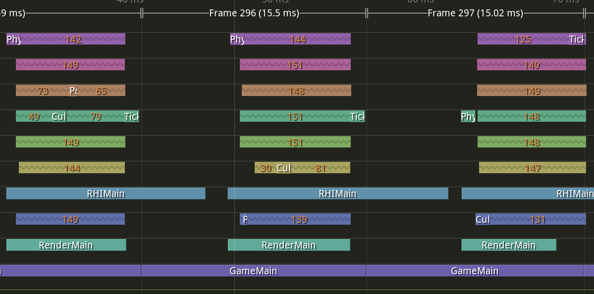
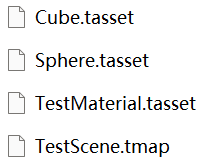
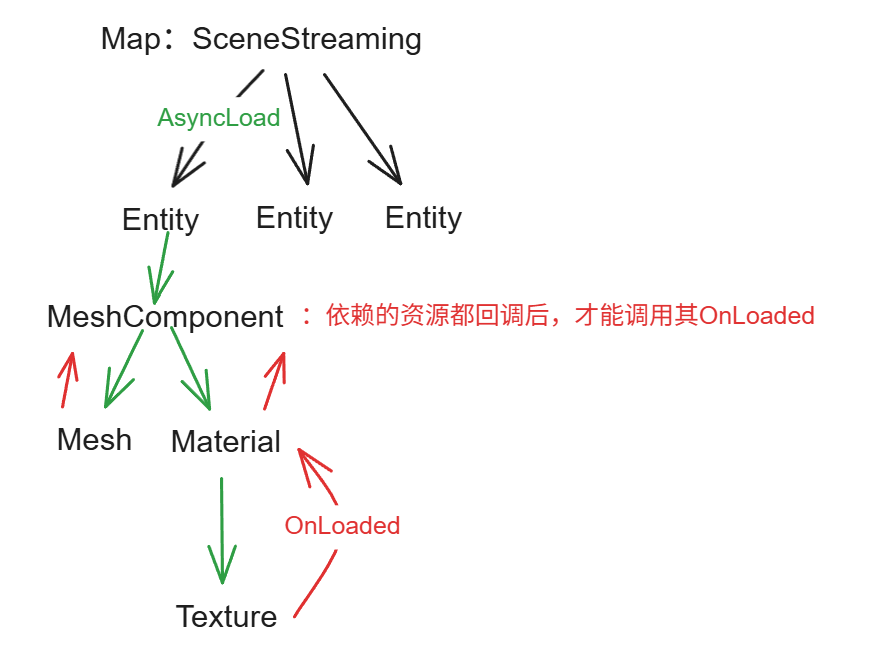
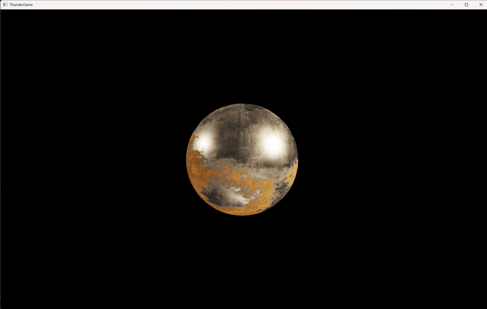

# ThunderEngine  

> 这是一个基础的游戏引擎学习项目，用于个人学习、复刻UE中的一些模块。

# 简介

## 基于无锁队列的多线程调度

Thunder Engine的整个主循环跑在无锁队列调度器上，分为Game、Render、RHI、同步Worker线程组、异步Worker线程组等。

可以任意时刻PUSH_RENDER_COMMAND：

```cpp
GRenderScheduler->PushTask([](){
	DoSomething();
});
```

## TaskGraph

在无锁队列调度器基础上实现的task graph：

```cpp
ExampleAsyncTask1* TaskA = new ExampleAsyncTask1(1, "TaskA");
ExampleAsyncTask1* TaskB = new ExampleAsyncTask1(2, "TaskB");
ExampleAsyncTask1* TaskC = new ExampleAsyncTask1(3, "TaskC");
ExampleAsyncTask1* TaskD = new ExampleAsyncTask1(4, "TaskD");
ExampleAsyncTask1* TaskE = new ExampleAsyncTask1(5, "TaskE");

TaskGraph->PushTask(TaskA);
TaskGraph->PushTask(TaskB, {TaskA});
TaskGraph->PushTask(TaskC, {TaskB});
TaskGraph->PushTask(TaskD);
TaskGraph->PushTask(TaskE, {TaskB, TaskD});

TaskGraph->Submit();
TaskGraph->WaitAndReset();
```

## 高度并行化

ThunderEngine的：

- 渲染线程MeshDraw支持并行录制。
- CachedMeshDrawCommand并行缓存。
- RHI线程多线程并行录制绘制命令。



# 绘制提交管线

## FrameGraph

支持UE风格的FrameGraph：

```cpp
PassOperations operations;
operations.Read(GBufferRT0);
operations.Write(LightingRT);
FrameGraph->AddPass(EVENT_NAME("Lighting"), std::move(operations), [this]()
{
    PassParameters->SetFloatParameter("PassParameters0", 0);
	// ……

    RenderModule::BuildDrawCommand(FrameGraph, pass, subMesh);
});
```

## MeshDraw缓存

利用CachedMeshDrawCommand实现高效的绘制提交管线，场景在加载完成时同时缓存mesh draw指令。

- 稳定的UniformBuffer引用：UniformBuffer可以在任何时候被更新，MeshDraw不需要被重新cache。
- 为不同更新频率的uniform buffer设计了persistent allocator和transient allocator，以实现内存效率与分配性能的最佳平衡。
- 切换贴图、材质等，将标脏并重新缓存。

## 定制的Shader语言！

针对ThunderEngine高度定制化的Shader语言，类似unity的ShaderLab，支持：

### **1. 与Thunder Engine深度集成**

基于 `Archive -> Subshader -> Combination` 划分的结构来组织：

```cpp
Shader "MyArchive"
{
    SubShader "MyPass1"
    {
        using VertexEntry = Pass1VertexShader;
        using PixelEntry = Pass1PixelShader;

		// ...
    }
    SubShader "MyPass2"
    {
        using VertexEntry = Pass2VertexShader;
        using PixelEntry = Pass2PixelShader;

		// ...
    }
}
```

### **2. MeshDraw支持：不同的SubShader映射到不同Pass**

简单声明即可自动集成进MeshDraw管线，无需再手动获取材质Shader：

```cpp
// PBR.tsf
Shader "PBR"
{
    SubShader "MyBasePass"
    {
        Attributes
        {
            MeshDrawType : "BasePass"
        }

		// ...
    }
    SubShader "MyPrePass"
    {
        Attributes
        {
            MeshDrawType : "PrePass"
        }

		// ...
    }
}
```

### **3. 变体声明 —— 常量表达式求值与裁剪**

声明变体：

```cpp
Variants
{
	bool _Variant0 = false;
	bool _Variant1;
}
```

设置变体：

```cpp
parameters->SetStaticSwitchParameter("_Variant1", true);
```

### **4. 渲染状态管理**

Shader中也能快速地修改管线状态，不再需要动引擎逻辑：

```cpp
Attributes
{
	DepthTest : "Near",
	BlendMode : "Opaque"
}
```

### **5. UniformBuffer反射**

不同频率更新的UniformBuffer：

```cpp
Parameters "Material"
{
	Texture2D<float4> AlbedoMap;
	Texture2D<float4> NormalMap;
	Texture2D<float4> MetallicRoughnessMap;
	int MaterialParameters0 = 1;
	float4 Color1 = float4(2, 3, 4, 5);
}
Parameters "Pass"
{
	float PassParameters0;
	float4 PassParameters1;
	float4 PassParameters2;
	int PassParameters3;
}
```

支持便捷的引擎交互，C++侧可以直接根据反射信息打包constants：

```cpp
PassParameters->SetFloatParameter("PassParameters0", 1.0f);
PassParameters->SetVectorParameter("PassParameters1", TVector4f(0.f, 0.f, 0.f, 1.f));
PassParameters->SetVectorParameter("PassParameters2", TVector4f(0.f, 0.f, 0.f, 1.f));
PassParameters->SetIntParameter("PassParameters3", 5);
```

## 资源管理

### 基于Package的资源管理

- GUID作为索引的仓库系统，解决UE难以挪动文件的痛点。
    - 启动时构建 `Guid <-> SoftPath` 双向映射，便于客户端使用。
- 显式的资源导入 —— 集中式管理。



### 场景异步加载

基于Package的异步加载，支持自动依赖分析：



## 内存管理

### General Memory Allocator

封装了高性能多线程内存分配器Mimalloc，为cpu常规对象分配提供统一入口，替代标准new/delete，实现高效且线程安全的内存管理。

```cpp
auto NewNode = new (TMemory::Malloc<TaskGraphNode>()) TaskGraphNode(Task);
TMemory::Destroy(Node);
```

### Transient Allocator

渲染线程临时对象使用TransientAllocator进行分配。

```cpp
RHIDrawCommand* newCommand = new (transientAllocator->Allocate<RHIDrawCommand>()) RHIDrawCommand;
```

## 构建系统

基于CMake的构建系统，类似UE的`.Build`的模块依赖声明：

```
// RenderCore.Build
set(ModuleName RenderCore)
set(LinkMode SHARED)
set(PublicDependencyModuleList
    Core
    RHI
)
// ...
```

## 简单的渲染器样例

少量代码即可实现的一个简单渲染器：



# 安装

- 需要cmake、python。
- 运行Setup.bat。
- 编译 `RelWithDebugInfo|x64` 即可运行。

